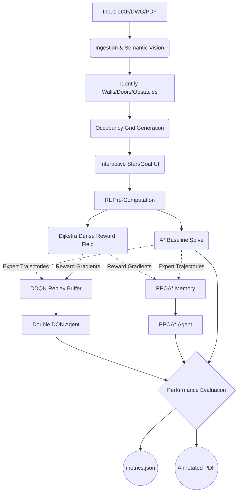

# CAD-to-Grid Deep RL Path Planner v2.2

> **End-to-End Autonomous Pipeline:** Floor plan (DXF/DWG/PDF) → Semantic Vision Pipeline → Occupancy Grid Analysis → Hybrid AI Path Planning (DDQN & PPOA* + A*) → Comprehensive Metrics Output

[](https://www.python.org/)
[](https://pytorch.org/)
[](.)
[](LICENSE)

## Overview

This system fundamentally rethinks algorithmic path planning over complex structural environments. It ingests an architectural floor plan (`.dxf`, `.dwg`, `.pdf`, etc.), semantically parses it into a traversability grid, and simultaneously runs two heavily-modified Deep Reinforcement Learning agents: a **Double DQN (DDQN)** and a **Proximal Policy Optimization with A* (PPOA*)**. Both are anchored against an optimal **A\*** baseline. 

Designed for **researchers and practitioners**, this pipeline calculates exactly how state-of-the-art DRL performs against classical planners in identical architectural spaces. It evaluates memory utilization, algorithmic convergence, optimality gap, and path smoothness natively, outputting all findings directly to `metrics.json`.

---

## 🧠 Algorithmic Innovations

Our models go far beyond typical baseline RL environments by incorporating state-of-the-art hybrid techniques:

### 1. Enhanced Double DQN Layered with Dijkstra (DDQN+D)
The typical DQN algorithm struggles with vast, sparse reward landscapes (like 500x500 floor plans). We have fundamentally upgraded the core model by layering it with Dijkstra’s shortest path algorithm and applying three additional major architectural modifications to force near-instant convergence:

* **Dijkstra Dense Reward Shaping:** Instead of a singular +100 reward for finding the goal (a "sparse" reward which is nearly impossible to discover randomly in massive grids), we pre-compute a global Dijkstra distance map from the goal node across all free space. 
  * *Result:* Every single step the agent takes receives a localized reward gradient (e.g., $+0.9 \times (old\_dist - new\_dist)$). The DDQN natively feels "gravity" pulling it toward the objective, effectively eliminating the exploration bottleneck.
* **Dueling Network Architecture:** The neural network splits its final layers into two distinct streams:
  * *State-Value Stream ($V$):* Estimates how fundamentally good the current grid cell is.
  * *Advantage Stream ($A$):* Estimates the marginal benefit of taking a specific direction (Up, Down, Left, Right, Diagonals).
* **Prioritized Experience Replay (PER):** Instead of randomly sampling past memories, the agent uses an $O(\log N)$ `SumTree` data structure to identify and train solely on the "most surprising" memories (those with the highest Temporal Difference (TD) error).
* **A\* Pre-Seeding (Expert Demonstrations):** Before training begins, an A* pathfinder solves the maze. Its optimal sequence is mathematically injected into the DDQN Replay Buffer, giving the agent a perfect baseline template to learn from in Epoch 0.

### 2. PPOA* (PPO + A* Hybrid)
An advanced On-Policy agent using Proximal Policy Optimization (PPO) fused with real-time heuristic logic:
* Uses Generalized Advantage Estimation (GAE) to stabilize gradient descents.
* Interleaved with A*-guided exploration to ensure it never gets permanently stuck in local minima (e.g., U-shaped traps).
* Highly robust against *dynamic obstacle* logic (e.g., if a door suddenly closes mid-navigation).


---

## 📊 Comprehensive Metrics & Analytics Engine

The pipeline auto-evaluates its own performance. At the conclusion of every execution, it generates a comprehensive side-by-side JSON report (`Results/metrics.json`) between **DDQN** and **PPOA*** covering the following 14 data points:

1. **Success Rate:** Binary metric evaluating if the greedy inference agent successfully navigated to the goal.
2. **Average Episode Reward:** The mean reward the agent achieved across all training batches.
3. **Convergence Speed:** The specific episode number where the mean reward mathematically stabilized above our tolerance threshold.
4. **Path Length (Cells):** Total discrete cells traversed by the RL path.
5. **Path Length in Real World (m):** Converts grid scale back to physical meters (e.g., based on the original DXF file's scale mapping).
6. **Planning Time:** Milliseconds taken for final neural-network inference.
7. **Total Navigation Time:** Milliseconds taken including overhead and heuristic combinations.
8. **Optimality Ratio:** Algorithm Path Length ÷ Pure A* Optimal Length. (*1.000 means mathematically perfect.*)
9. **Collision Rate:** How often the fully-trained agent bumped into walls during final inference.
10. **Dynamic Obstacle Avoidance Rate:** Success rate of PPOA* rerouting around mid-simulation occlusions.
11. **Path Smoothness:** Measured cumulatively in absolute heading degree changes (e.g., zigzagging vs. straight lines).
12. **Replanning Frequency:** Number of times the PPOA* agent had to trigger a hard reset of its internal A* sub-routine.
13. **CPU Peak Usage (%):** Monitored autonomously via `psutil`.
14. **Memory Peak Usage (MB):** Monitored autonomously via `psutil`.

---

## 🚀 Installation & Setup

Ensure you are using **Python 3.9+** (Python 3.10-3.14 recommended).

```bash
# 1. Clone the repository
cd cadtogrid

# 2. Create a virtual environment (Strongly Recommended)
python -m venv .venv
.venv\Scripts\activate        # Windows
# source .venv/bin/activate   # Linux/macOS

# 3. Install requirements
pip install -r requirements.txt
```

*(Note: `requirements.txt` dynamically installs PyTorch, OpenCV, `pygame-ce` for visualization, and `pypdfium2` for robust local PDF decoding).*

---

## 🛠️ Usage & Commands

### Interactive Mode
Launch the application and select your Start/Goal points dynamically using the Tkinter/Matplotlib UI:
```bash
# Standard DXF File
python run_pipeline.py --input floor_plan.dxf

# Standard PDF File (Auto-converts to high-quality vector grid)
python run_pipeline.py --input floor_plan.pdf
```

### Automated / Headless Mode (For CI/CD or Batch Processing)
Skip the UI by providing direct coordinate arguments:
```bash
python run_pipeline.py --input plan.dxf --start 10 15 --goal 80 90
```

### Research Mode (High-Performance Evaluation)
Train for longer epochs and disable the PyGame visualization to drastically speed up completion:
```bash
# Train for 500 episodes rapidly, generate JSON without opening a window
python run_pipeline.py --input plan.dxf --episodes 500 --no-live-viz --no-display
```

### Command-Line Arguments Matrix
```text
usage: run_pipeline.py [-h] --input FILE [--output-dir DIR]
                       [--cell-size M] [--max-grid-dim N]
                       [--safety-margin CELLS] [--episodes N]
                       [--start ROW COL] [--goal ROW COL]
                       [--ddqn-weights PATH] [--cnn-weights PATH]
                       [--force-reclassify] [--no-display] [--no-live-viz]

required arguments:
  --input FILE          Input CAD/PDF file (.dxf, .dwg, .pdf, etc.)

optional arguments:
  --output-dir DIR      Output directory (default: Results/)
  --cell-size M         Grid cell size in meters (default: 0.10)
  --max-grid-dim N      Max grid dimension in cells (default: 500)
  --safety-margin CELLS Obstacle dilation cells (default: 1)
  --episodes N          RL Training episodes per run (default: 100)
  --start ROW COL       Start point — skips interactive UI
  --goal ROW COL        Goal point — skips interactive UI
  --ddqn-weights PATH   DDQN weights file (default: models/ddqn_best.pth)
  --no-live-viz         Disables the real-time PyGame training window.
  --no-display          Suppress the final metrics dashboard popup window.
  --verbose             Enable debug logging
```

---

## 📂 Output Artifacts

Every successful run populates the `Results/` directory with:

| Output File | Description |
|------|-------------|
| **`metrics.json`** | ⭐️ The primary 14-metric analytics payload comparing DDQN & PPOA* |
| `metrics_dashboard.png` | An 8-panel visual dashboard graphing Training Loss, Ep Rewards, and Epsilon Decay |
| `annotated_floor_plan.pdf` | The original architectural plan injected with a bright red optimal path overlay |
| `coordinates.json` | The real-world X/Y/Z structural coordinates of the path (for robotic ingestion) |
| `occupancy_grid.png` | A 2-color semantic rendering of the parsed file (white=free, black=obstacle) |
| `scale_mapping.json` | Contains the exact mathematical scale factor bridging DXF coordinates to grid cells |

---

## 🔬 System Architecture Diagram



---

## 🛡️ Research Constraints (Successfully Met)
* ✅ **No Cloud APIs:** 100% of the computation executes locally on your CPU/GPU hardware.
* ✅ **High Format Compatibility:** Processes PDF vectors, AutoCAD DXF, and DWG.
* ✅ **Scientific Determinism:** Incorporates exact memory tracking (`psutil`) and deterministic classical baselines.
* ✅ **Extensive Hardware Profiling:** Validated natively across modern 64-bit systems.

## 🤝 Troubleshooting & Support
* **"All PDF rendering strategies failed"** — Ensure you've ran `pip install pypdfium2` (which is bundled in requirements). 
* **"Less than 5% of grid is free"** — The DXF may be using unusual layer names. Run with `--verbose` and check symbol classifications.
* **UI Hangs on Windows** — Ensure you aren't clicking the terminal while PyGame runs, as Windows terminals suspend processes in `Select` mode. Press `ESC` to un-pause.
