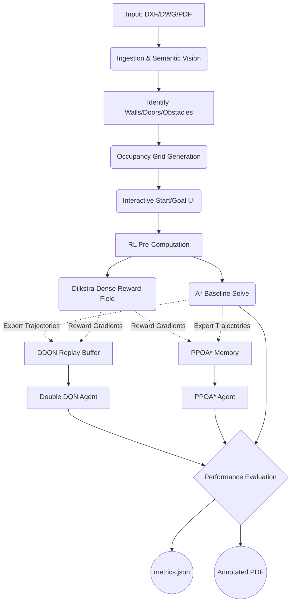

# Reinforcement Learning Based Path Planning (RPP)


A comprehensive autonomous path planning system where agents learn to navigate through environments while avoiding obstacles and minimizing travel cost. 

Originally developed as an **IPD (Innovative Product Development)** course project simulating an urban grid world, this repository has evolved into a full end-to-end autonomous pipeline capable of ingesting real-world CAD floor plans and applying state-of-the-art Deep Reinforcement Learning.

---

## 🚀 Latest Release: CAD-to-Grid Deep RL Path Planner (v2.2)

> **End-to-End Autonomous Pipeline:** Floor plan (DXF/DWG/PDF) → Semantic Vision Pipeline → Occupancy Grid Analysis → Hybrid AI Path Planning (DDQN & PPOA* + A*) → Comprehensive Metrics Output

This system fundamentally rethinks algorithmic path planning over complex structural environments. It ingests an architectural floor plan, semantically parses it into a traversability grid, and simultaneously runs two heavily-modified Deep Reinforcement Learning agents anchored against an optimal **A\*** baseline. 

Designed for **researchers and practitioners**, this pipeline calculates exactly how DRL performs against classical planners in identical architectural spaces. It evaluates memory utilization, algorithmic convergence, optimality gap, and path smoothness natively.

### 🧠 Algorithmic Innovations (v2.2)

Our models go far beyond typical baseline RL environments by incorporating hybrid techniques:

**1. Enhanced Double DQN Layered with Dijkstra (DDQN+D)**
The typical DQN algorithm struggles with vast, sparse reward landscapes (like 500x500 floor plans). We upgraded the core model by layering it with Dijkstra’s shortest path algorithm:
* **Dijkstra Dense Reward Shaping:** A global Dijkstra distance map from the goal node is pre-computed. Every step the agent takes receives a localized reward gradient, effectively eliminating the exploration bottleneck.
* **Dueling Network Architecture:** The neural network splits its final layers into a *State-Value Stream* (how good the cell is) and an *Advantage Stream* (marginal benefit of directional actions).
* **Prioritized Experience Replay (PER):** Uses an $O(\log N)$ `SumTree` to train solely on the "most surprising" memories with the highest Temporal Difference error.
* **A\* Pre-Seeding:** Before training begins, an A* pathfinder solves the maze. Its optimal sequence is mathematically injected into the DDQN Replay Buffer in Epoch 0.

**2. PPOA* (PPO + A* Hybrid)**
An advanced On-Policy agent using Proximal Policy Optimization (PPO) fused with real-time heuristic logic:
* Uses Generalized Advantage Estimation (GAE) to stabilize gradient descents.
* Interleaved with A*-guided exploration to ensure it never gets permanently stuck in local minima.
* Highly robust against *dynamic obstacles* (e.g., if a door suddenly closes mid-navigation).

### 📊 Metrics & Analytics Engine
At the conclusion of every execution, it generates a comprehensive side-by-side JSON report (`Results/metrics.json`) between **DDQN** and **PPOA*** covering 14 data points, including: Success Rate, Convergence Speed, Path Length (Cells vs Real World m), Planning/Navigation Time, Optimality Ratio, Collision Rate, Path Smoothness, and Hardware Peak Usage. 

**Note:** To provide a true reflection of overall agent behavior and stability, most path-related metrics (Length, Smoothness, Collisions) are calculated as the true mean average across all training episodes rather than a single greedy inference run. Furthermore, visual overlays (`metrics_dashboard.png`) will always render the **latest successful path** the agent discovered during training, ensuring you can visually inspect exactly how it reached the goal.

### 🔬 System Architecture (v2.2)



---

## 🧱 Foundation: Phase 1 (GridWorld Q-Learning)

The foundational phase of this project simulates an **urban grid world** containing buildings, traffic signals, trees, shops, and road barriers. The agent learns the optimal path to a goal using classical Q-Learning.

### Environment & State Space
The environment is represented as a 2D Grid World where each cell corresponds to the **agent position** `(state_x, state_y)`. 

| Symbol | Meaning | Role in Environment |
|------|------|------|
| **Empty Cell** | Road | Safe traversable path |
| **Tree** | Obstacle | Collision penalty |
| **Building** | Restricted zone | Impassable terrain |
| **Traffic Signal** | Movement constraint | Conditional traversal |
| **Shop** | Static obstacle | Collision penalty |
| **Goal** | Target destination | Terminal state / Success |

### Q-Learning Algorithm
Phase 1 implements model-free **Q-Learning** based on the Bellman equation. The agent chooses between four actions (UP, DOWN, LEFT, RIGHT) based on the following update rule:

$$Q(s,a) = Q(s,a) + \alpha \left[ r + \gamma \max_{a'} Q(s',a') - Q(s,a) \right]$$

*Where:* **$s$** = Current state, **$a$** = Action taken, **$r$** = Reward, **$s'$** = Next state, **$\alpha$** = Learning rate, **$\gamma$** = Discount factor.

### Reward System
* **Move to valid cell:** Small negative reward (encourages efficiency)
* **Hit obstacle / Invalid move:** Large negative reward / Penalty
* **Reach goal:** Large positive reward

### Phase 1 Results
**Environment Visualization & Training Graph:**


---

## ⚙️ Installation & Setup

Ensure you are using **Python 3.9+**.

```bash
# 1. Clone the repository
git clone [https://github.com/d-sanghavi/Reinforcement_Path_Planning.git](https://github.com/d-sanghavi/Reinforcement_Path_Planning.git)
cd Reinforcement_Path_Planning

# 2. Create and activate a virtual environment
python -m venv rl_env

# Windows:
rl_env\Scripts\activate
# Linux / Mac:
source rl_env/bin/activate

# 3. Install dependencies
pip install -r requirements.txt

# 4. Train Model By Symbols
python ./symbol_model/train_symbol_classifier.py
```
*(Note: For Phase 1 fallback, you only need `pip install numpy matplotlib pygame`. The full `requirements.txt` handles PyTorch, OpenCV, and `pypdfium2` for v2.2).*

---

## 🛠️ Usage & Commands

### Running v2.2: CAD-to-Grid Deep RL

**Interactive Mode (UI)**
Launch the application and select your Start/Goal points dynamically using the Tkinter/Matplotlib UI:
```bash
python run_pipeline.py --input floor_plan.dxf
python run_pipeline.py --input floor_plan.pdf # Auto-converts to vector grid
```

**Automated / Headless Mode (CI/CD / Batch Processing)**
Skip the UI by providing direct coordinate arguments:
```bash
python run_pipeline.py --input plan.dxf --start 10 15 --goal 80 90
```

**Research Mode (High-Performance Evaluation)**
Train rapidly by disabling visualizations:
```bash
python run_pipeline.py --input plan.dxf --episodes 500 --no-live-viz --no-display
```

### Running Phase 1: Basic GridWorld
To train the legacy Q-Learning agent on the discrete urban grid:
```bash
python run_agent.py
```
*This will initialize the environment, train the agent, visualize the grid world, and plot performance graphs.*

---

## 📂 Output Artifacts & Project Structure

Every successful v2.2 run populates the `Results/` directory with automated analytics:

| Output File | Description |
|------|-------------|
| **`metrics.json`** | ⭐️ The primary 14-metric analytics payload comparing DDQN & PPOA* |
| `metrics_dashboard.png` | An 8-panel visual dashboard graphing Training Loss, Ep Rewards, and Epsilon Decay |
| `annotated_floor_plan.pdf` | The original architectural plan injected with a bright red optimal path overlay |
| `coordinates.json` | The real-world X/Y/Z structural coordinates of the path (for robotic ingestion) |
| `occupancy_grid.png` | A 2-color semantic rendering of the parsed file (white=free, black=obstacle) |
| `scale_mapping.json` | Contains the exact mathematical scale factor bridging DXF coordinates to grid cells |

**Core File Structure:**
```text
Reinforcement_Path_Planning/
├── agent_brain.py        # Phase 1: Q-learning agent implementation
├── env.py                # Phase 1: Grid world environment
├── run_agent.py          # Phase 1: Training and execution script
├── run_pipeline.py       # v2.2: Master entry point for CAD Deep RL
├── requirements.txt      # Dependency configurations
├── Results/              # Automatically generated metrics and visual outputs
└── README.md             
```

---

## 🤝 Troubleshooting & Support (v2.2)
* **"All PDF rendering strategies failed"** — Ensure `pypdfium2` is installed via requirements. 
* **"Less than 5% of grid is free"** — The DXF may be using unusual layer names. Run with `--verbose` and check symbol classifications.
* **UI Hangs on Windows** — Ensure you aren't clicking the terminal while PyGame runs, as Windows terminals suspend processes in `Select` mode. Press `ESC` to un-pause.

---

## 👥 Authors
* **Suhani Gupta** (Leader)
* **Paridhi Jain**
* **Dhruv Sanghavi**
* **Khush Shah**

*Developed for the IPD Project – Reinforcement Learning Path Planning for (at most 2) robots.*

## 📜 License
This project is licensed under the MIT License.